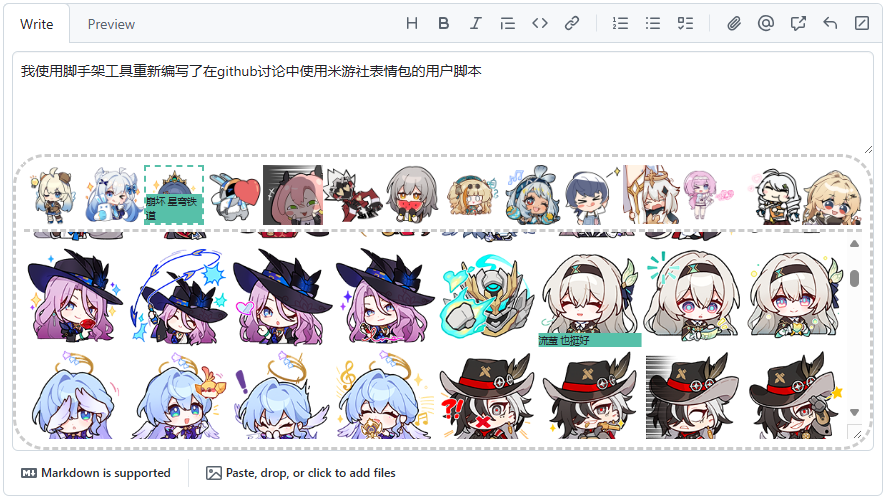

## GitHub讨论米游社表情包
用户脚本，需要使用脚本管理器加载，用于在github讨论、issue使用米游社表情包。

### 使用方法

1. 装脚本首先需要一个脚本管理器（比如[某猴](https://www.tampermonkey.net/)）（当然，你的浏览器可能自带脚本支持）
2. 然后，[安装脚本](https://dave-12138.cn/static/Tampermonkey/miyoushe-emot-to-github.user.js) *(该链接对非中国大陆IP有cloudflare人机验证，如遇访问困难请尝试关闭代理或使用[github源](https://dave-12138.github.io/miyoushe-emoticon-in-discussion/miyoushe-emot-to-github.user.js))*
3. 访问任意一个讨论/issue页面，**点击输入框**会出现本脚本的UI（如图所示）。如果有弹窗询问跨域许可，点击`总是允许此域名`
<!--  -->
4. 上面一排表情图片是分类按钮，点击任意分类按钮展开对应分类。

5. 点击下方的表情图标，会将表情（就是那个&lt;img&gt;标签）填入输入框。

6. 如果你发现随着游戏版本更新，米游社添加了新表情，但你在脚本提供的表情列表界面找不到，请使用这个：

> [!note]
> 弃用 img 标签来渲染表情列表应该不会有人尝试复制图片地址或者拖拽表情图标了
> > 毕竟 GitHub 自有安全策略在此，所有外链图片直接插入dom结构都会被挡掉
> >
> > 所以表情包列表的表情链接都是临时虚构的

> [!important]
> 使用脚本前，注意你的代理工具是否代理了浏览器与米游社的连接
>
> 如果是，抛开这会让加载表情包列表的速度降低不提，希望你的代理工具流量够用

### 关于本项目
用了 vite + vue ，使用 GM_xmlhttpRequest API 获取表情包列表和表情包图片，通过 GM_registerMenuCommand 、 GM_getValue 、 GM_setValue 缓存拿到的表情包列表并控制刷新时机， 使用  GM_addStyle 注入UI样式。

Vue 的 cdn 用的是360 (lib.baomitu.com)。

